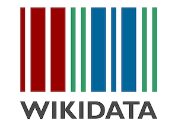
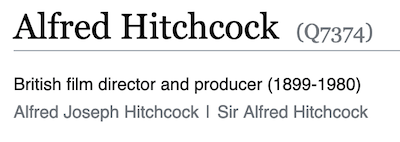

# Linked Media Formats

## Intro: What Even *IS* Linked Open Data?

Getting started with Linked Open Data (LOD) can be overwhelming. At its core, LOD is a way of connecting elements of metadata records (**Title**, **Creator**, and so on) to accepted definitions that can be used and reused by anyone. Many of these collected definitions (or **taxonomies**–think of it like a dictionary) are community-sourced and accept additions and edits from community members worldwide. That's incredible! Instead of everyone making their own dictionaries, we can share one and agree together where the definitions live.



For example, we can add "Alfred Hitchcock" as a creator to our record for our 16mm print of *The Lady Vanishes*. Our pals in Russia can add "Хичкок, Альфред" to their local record, and since we both point to the same **identifier** for Hitch (the [**URI**](https://www.wikidata.org/wiki/Q7374) hosted by **WikiData**) we all know who we are talking about. There is less confusion, less room for individual human error ("Afred Hichcok"?), and a shared responsibility for descriptive cataloging labor. This concept of **authorty control** has been around in libraries for over a century, but the _**Linked**_ part of Linked Open Data means that the structure of each record is defined in terms of its relationships to other defined terms, using terms that can be read and recognized by computers in addition to humans. This is key and why LOD is such a powerful way of describing things like audiovisual works.



Each element of an LOD record is structured in terms of Subject-Predicate-Object (**Thing A** - **has some relationship to** - **Thing B**). This relationship is usually called a "triple." For example, every piece of the WikiData record that describes Alfred Hitchcock is linked to other definitions within WikiData (and also to external data sources!). In the Subject-Predicte-Object model, you can say **Alfred Hitchcock** - **has the occupation** - **Film director**. This relationship links to the definition of **Film director**, where you can read about what a Film director is, what they do, and also see the other records for directors that are linked here.

To get more granular, you can think about a 16mm film print (WikiData id [Q194383](https://www.wikidata.org/wiki/Q194383)) of *The Lady Vanishes* that is black and white (WikiData id [Q838368](https://www.wikidata.org/wiki/Q838368)), and compare it to a VHS (WikiData id [Q183976](https://www.wikidata.org/wiki/Q183976)) copy that is colorized (Library of Congress Subject [sh88002478](https://id.loc.gov/authorities/subjects/sh88002478.html)). Both of these will share elements related to the production (Title, Director, Release Year), but will differ in fields related to format, condition, and so on.

This example also hints at one of the missing elements of LOD as it could be used by audiovisual archivists to describe formats. The record for "colorization of motion pictures" above is linked to a *Subject* taxonomy, so we referenced "colorization as the subject" of a work, but not explicitly a definition of colorization as a *physical characteristic* of an audiovisual work. This is one large to-do for AV archivists interested in LOD as a tool for describing our collections–we are missing taxonomy entries that are explicitly relevant to AV archives. For example, there is no entry in WikiData for "vinegar syndrome," or for the tape based errors in the [AV Artifact Atlas](https://www.avartifactatlas.com/index.html) like "video dropout."

Our hope here is to explore the implications for LOD for AV media description, and to compile some resources and examples that can help AV archivists get started. One accessible starting place is to think about linking existing catalog records with external data sources and vocabularies. Connecting existing records to the existing rich ecosystem of linked data is a step towards making our cataloging that much more useful to users. Another step is to update taxonomies like WikiData with records for terms specific to our field (the **Open** part of LOD)

## OK How Does It Work?
What does LOD metadata look like? The most basic answer is that the common way to represent LOD as machine and human readable text is with JSON (JavaScript Object Notation), which is essentially a list of `key:value` pairs enclosed in curly brackets `{}`. This kind of intimidating looking format can then be read and interpreted by different display systems (like the WikiData website, or IMDb.com!) to be a little easier on the eyes.

One widely used and well-documented structured data format is [schema.org](schema.org), which includes fields for LOD. Here is their metadata example for a [Movie](https://schema.org/Movie) in JSON-LD format ("JSON-Linked Data" 😉), with linked data fields in bold:
<pre>
{
     "@type": "Movie",
     <b>"@id": "https://www.wikidata.org/wiki/Q836821" </b>
     "name": "The Hitchhiker's Guide to the Galaxy",
     <b>"titleEIDR": "10.5240/B752-5B47-DBBE-E5D4-5A3F-N",</b>
     "disambiguatingDescription": "VUDU version",
}
</pre>

## Sources of Identifiers
As seen in the schema.org example above, [WikiData](https://wikidata.org/) and the [Entertainment Identifier Registry (EIDR)](https://ui.eidr.org/) are two stable sources of LOD identifiers. In fact, these are the two recommended sources from the [FIAF Linked Open Data Task Force](https://www.fiafnet.org/pages/E-Resources/LoD-Task-Force-Workshop-2019.html).

You can also search for other LOD vocabulary and authority sources on [BARTOC](http://bartoc.org/), for example those related to "[film](http://bartoc.org/vocabularies?search=film#)".

## What is @id Doing?
Linking to external identifiers is at the heart of Linked Data. In JSON-LD, this is often done in the `@id` field. You can see the distinction below:

A LOD resource as value:

```
{
  "landingPage": {
    "@id": "http://www.europeana.eu/portal/record/09102/_CM_0839888.html"
  },
  ...
}

```

A string literal as value:

```
{
  "creator": "Europeana",
   ...
}
```

(source: [Europeana](https://pro.europeana.eu/page/record))

## Schemas and Ontologies in JSON-LD

It's possible to combine fields from different schemas and ontologies using the JSON-LD `@context` part. For example, here we know that fields from Dublin Core and the European Data Model (EDM) will be used to describe our item. Any field prefixed with `dc`, such as `dc:creator`, we know refers for the Dublin Core ontology.
<pre>
{
  <b>"@context"</b>: {
    "edm": "http://www.europeana.eu/schemas/edm/",
    "dc": "http://purl.org/dc/elements/1.1/",
  },
 "@graph": [{
    ...
   <b> "dc:creator": "AMIA Open Source",</b>
    }]
 }
</pre>


## LOD for Media Formats
We noticed that most writing on LOD for film and media focus on title and name authorities. We were curious about the implications for LOD for media formats and compiled the beginning of a list for reference.

### Film
 - **PBCore** provides LOD for gauged film formats in its [instantiationPhysical Film Vocabulary](http://pbcore.org/pbcore-controlled-vocabularies/instantiationphysical-film-vocabulary/).
     - [[8mm](http://pbcore.org/pbcore-controlled-vocabularies/instantiationphysical-film-vocabulary/#8mmFilm), [9.5mm](http://pbcore.org/pbcore-controlled-vocabularies/instantiationphysical-film-vocabulary/#9andaHalfmmFilm), [Super 8mm](http://pbcore.org/pbcore-controlled-vocabularies/instantiationphysical-film-vocabulary/#Super8mmFilm), [16mm](http://pbcore.org/pbcore-controlled-vocabularies/instantiationphysical-film-vocabulary/#16mmFilm), [Super 16mm](http://pbcore.org/pbcore-controlled-vocabularies/instantiationphysical-film-vocabulary/#Super16mmFilm), [22mm](http://pbcore.org/pbcore-controlled-vocabularies/instantiationphysical-film-vocabulary/#22mmFilm), [28mm](http://pbcore.org/pbcore-controlled-vocabularies/instantiationphysical-film-vocabulary/#28mmFilm), [35mm](http://pbcore.org/pbcore-controlled-vocabularies/instantiationphysical-film-vocabulary/#35mmFilm), [70mm](http://pbcore.org/pbcore-controlled-vocabularies/instantiationphysical-film-vocabulary/#70mmFilm](http://pbcore.org/pbcore-controlled-vocabularies/instantiationphysical-film-vocabulary/#70mmFilm))]

 - **Getty AAT** provides LOD for members of its  \<size for photographic film> [term](http://vocab.getty.edu/aat/300263814):
     - [[8mm](http://vocab.getty.edu/aat/300263859), [16mm](http://vocab.getty.edu/aat/300263815), [Super 16mm](http://vocab.getty.edu/aat/300264669), [35mm](http://vocab.getty.edu/aat/300263816), [65mm](http://vocab.getty.edu/aat/300264670), [70mm](http://vocab.getty.edu/aat/300264672)]


 - **Wikidata** has entries for several sizes:
     - [[8mm](https://www.wikidata.org/wiki/Q270183), [16mm](https://www.wikidata.org/wiki/Q194383), [Super 16mm](https://www.wikidata.org/wiki/Q2713357)]

### Video
 - **PBCore** provides LOD for physical video formats in its [instantiationPhysical Video Vocabulary](http://pbcore.org/pbcore-controlled-vocabularies/instantiationphysical-video-vocabulary/).
   - [[Videocassette](http://pbcore.org/pbcore-controlled-vocabularies/instantiationphysical-video-vocabulary/#Videocassette), [Open reel videotape](http://pbcore.org/pbcore-controlled-vocabularies/instantiationphysical-video-vocabulary/#OpenReelVideoTape), [Optical video disc](http://pbcore.org/pbcore-controlled-vocabularies/instantiationphysical-video-vocabulary/#OpticalVideoDisc), [1 inch videotape](http://pbcore.org/pbcore-controlled-vocabularies/instantiationphysical-video-vocabulary/#1InchVideotape), [1/2 inch videotape](http://pbcore.org/pbcore-controlled-vocabularies/instantiationphysical-video-vocabulary/#HalfInchVideotape), [1/4 inch videotape](http://pbcore.org/pbcore-controlled-vocabularies/instantiationphysical-video-vocabulary/#QuarterInchVideotape), [2 inch videotape](http://pbcore.org/pbcore-controlled-vocabularies/instantiationphysical-video-vocabulary/#2InchVideotape), [Betacam](http://pbcore.org/pbcore-controlled-vocabularies/instantiationphysical-video-vocabulary/#Betacam), [Betacam SX](http://pbcore.org/pbcore-controlled-vocabularies/instantiationphysical-video-vocabulary/#BetacamSX), [Betamax](http://pbcore.org/pbcore-controlled-vocabularies/instantiationphysical-video-vocabulary/#Betamax), [Blu-ray disc](http://pbcore.org/pbcore-controlled-vocabularies/instantiationphysical-video-vocabulary/#BluRayDisc), [Catrivision](http://pbcore.org/pbcore-controlled-vocabularies/instantiationphysical-video-vocabulary/#Catrivision), [D1](http://pbcore.org/pbcore-controlled-vocabularies/instantiationphysical-video-vocabulary/#D1), [D2](http://pbcore.org/pbcore-controlled-vocabularies/instantiationphysical-video-vocabulary/#D2), [D3](http://pbcore.org/pbcore-controlled-vocabularies/instantiationphysical-video-vocabulary/#D3), [D5](http://pbcore.org/pbcore-controlled-vocabularies/instantiationphysical-video-vocabulary/#D5), [D6](http://pbcore.org/pbcore-controlled-vocabularies/instantiationphysical-video-vocabulary/#D6), [D9](http://pbcore.org/pbcore-controlled-vocabularies/instantiationphysical-video-vocabulary/#D9), [DCT](http://pbcore.org/pbcore-controlled-vocabularies/instantiationphysical-video-vocabulary/#DCT), [Digital Betacam](http://pbcore.org/pbcore-controlled-vocabularies/instantiationphysical-video-vocabulary/#DigitalBetacam), [Digital8](http://pbcore.org/pbcore-controlled-vocabularies/instantiationphysical-video-vocabulary/#Digital8), [DV](http://pbcore.org/pbcore-controlled-vocabularies/instantiationphysical-video-vocabulary/#DV), [DVCAM](http://pbcore.org/pbcore-controlled-vocabularies/instantiationphysical-video-vocabulary/#DVCAM), [DVCPRO](http://pbcore.org/pbcore-controlled-vocabularies/instantiationphysical-video-vocabulary/#DVCPRO), [DVD](http://pbcore.org/pbcore-controlled-vocabularies/instantiationphysical-video-vocabulary/#DVD), [EIAJ](http://pbcore.org/pbcore-controlled-vocabularies/instantiationphysical-video-vocabulary/#EIAJ), [EVD](http://pbcore.org/pbcore-controlled-vocabularies/instantiationphysical-video-vocabulary/#EVD), [HDCAM](http://pbcore.org/pbcore-controlled-vocabularies/instantiationphysical-video-vocabulary/#HDCAM), [HDV](http://pbcore.org/pbcore-controlled-vocabularies/instantiationphysical-video-vocabulary/#HDV), [Hi8](http://pbcore.org/pbcore-controlled-vocabularies/instantiationphysical-video-vocabulary/#Hi8), [LaserDisc](http://pbcore.org/pbcore-controlled-vocabularies/instantiationphysical-video-vocabulary/#LaserDisc), [MII](http://pbcore.org/pbcore-controlled-vocabularies/instantiationphysical-video-vocabulary/#MII), [MiniDV](http://pbcore.org/pbcore-controlled-vocabularies/instantiationphysical-video-vocabulary/#MiniDV), [Super Video CD](http://pbcore.org/pbcore-controlled-vocabularies/instantiationphysical-video-vocabulary/#SuperVideoCD), [U-matic](http://pbcore.org/pbcore-controlled-vocabularies/instantiationphysical-video-vocabulary/#Umatic), [Universal Media Disc](http://pbcore.org/pbcore-controlled-vocabularies/instantiationphysical-video-vocabulary/#UniversalMediaDisc), [V-Cord](http://pbcore.org/pbcore-controlled-vocabularies/instantiationphysical-video-vocabulary/#Vcord), [VHS](http://pbcore.org/pbcore-controlled-vocabularies/instantiationphysical-video-vocabulary/#VHS), [Video8](http://pbcore.org/pbcore-controlled-vocabularies/instantiationphysical-video-vocabulary/#Video8), [VX](http://pbcore.org/pbcore-controlled-vocabularies/instantiationphysical-video-vocabulary/#VX)]

- **Getty AAT** provides LOD, but further research is needed to identify the appropriate Guide Term(s) and Object(s) related to physical video.

- **Wikidata** has entries for several physical video formats and carriers, including:
   - [[Betacam](https://www.wikidata.org/wiki/Q830910), [Digital Betacam](https://www.wikidata.org/wiki/Q1751553), [Betacam SP](https://www.wikidata.org/wiki/Q830904), [videotape](https://www.wikidata.org/wiki/Q747779), [VHS](https://www.wikidata.org/wiki/Q183976), [DVD](https://www.wikidata.org/wiki/Q5294),
[Laserdisc](https://www.wikidata.org/wiki/Q273309), [open reel videotape](https://www.wikidata.org/wiki/Q29167500), [U-matic](https://www.wikidata.org/wiki/Q278080), [Betamax](https://www.wikidata.org/wiki/Q690148), [Blu-ray Disc](https://www.wikidata.org/wiki/Q47770), [Digital Betacam](https://www.wikidata.org/wiki/Q1751553)
[Digital8](https://www.wikidata.org/wiki/Q930337), [DV](https://www.wikidata.org/wiki/Q3796889), [DVCAM](https://www.wikidata.org/wiki/Q1361160), [HDCAM](https://www.wikidata.org/wiki/Q1194529), [8 mm video format](https://www.wikidata.org/wiki/Q1155472), [MiniDV](https://www.wikidata.org/wiki/Q6957908), [Hi8](https://www.wikidata.org/wiki/Q2302273)]


## Example Record
Here's a kitchen sink example of a JSON-LD record, combining what we've outlined above!

<pre>
{
  "@context": {
    "sch": "https://schema.org/",
    "edm": "http://www.europeana.eu/schemas/edm/",
    "pbc": "http://pbcore.org/pbcore-controlled-vocabularies/",
    "custom": "http://myinstitution.com"
  },
  "@graph": [
    {
      "@id": "https://www.wikidata.org/wiki/Q202548",
      "@type": "sch:Movie",
      "sch:name": "Vertigo",
      "sch:datePublished": "1958",
      "sch:director": {
        "@id": "https://www.wikidata.org/wiki/Q7374"
      },
      "sch:titleEIDR": {
        "@id": "10.5240/39FE-B96B-01BE-453E-64D7-E"
      },
      "sch:sameAs": {
        "@id": "https://www.imdb.com/title/tt0052357"
      },
      "sch:workExample": {
        "@type": "sch:Movie",
        "sch:editEIDR": {
          "@id": "10.5240/BDF9-F812-FC30-3EAF-AEB3-O",
          "sch:disambiguatingDescription": "35mm Theatrical Print"
        },
        "sch:duration": "PT2H8M",
        "pbc:instantiationPhysical": {
          "@id": "http://pbcore.org/pbcore-controlled-vocabularies/instantiationphysical-film-vocabulary/#35mmFilm"
        },
        "custom:gauge": {
          "@id": "https://www.wikidata.org/wiki/Q226528"
        }
      }
    },
    {
      "@id": "http://semium.org/time/1958",
      "@type": "edm:TimeSpan"
    }
  ]
}
</pre>

Explanation of example record coming soon..

## Glossary

Here are some terms that are used with Linked Open Data. More definitions will come soon!

* Identifier
  * This is the unique identifier used within a system (like WikiData) that points to the thing being described. In the examples above, within the WikiData universe, the identifer "Q7374" means "the Alfred Hitchock who was a film director and lived from 1899-1980."
	* This concept is related to **URI** below, as it is usually part of the full link to the item within a given system.
* JSON
  * "JavaScript Object Notation"
	* A very commonly used way of representing information in `Key:value` pairs, for example `{"creator":"Alfred Hitchcock"}`. It is comparable to data structures like XML, in that it is readable both by humans and machines.
	* [Wikipedia page](https://en.wikipedia.org/wiki/JSON)
* JSON-LD
  * A standardized way of using JSON to represent linked data.
	* [Wikipedia page](https://en.wikipedia.org/wiki/JSON-LD)
* Linked Open Data
  * Structured data that allows linkages between described people, things, concepts, and so on. It is "open" as it is generally open to community authorship and editing. Often represented in
	* [Wikipedia page](https://en.wikipedia.org/wiki/Linked_data)
* Ontology
  * [Wikipedia page](https://en.wikipedia.org/wiki/Linked_data#Ontologies)
* RDF
  * "Resource Description Framework"
	* This is a data model that defines how to describe the relationships between things or concepts. In the examples above, the **Subject**-**Predicate**-**Object** relationship is defined by RDF. **FOAF** ("Friend of a Friend") is a common implementation of RDF that can be used to define things like the **Predicate** "is the creator of" in the statement "Alfred Hitchcock is the creator of *Vertigo*."
	* [Wikipedia page](https://en.wikipedia.org/wiki/Resource_Description_Framework)
* schema.org
* SPARQL
  * This is a "query language" similar to SQL that actually does the linking between linked records. It uses the "**Subject**-**Predicate**-**Object**" structure of linked data (specifically in the **Resource Description Framework** data structure). It is a powerful way of searching to link records using LOD.
	* [Wikipedia page](https://en.wikipedia.org/wiki/SPARQL)
* Taxonomy
* Triple
 * The "**Subject**-**Predicate**-**Object**" is the semantic relationship described by LOD, and is referred to as a "triple." In order to make a valid statement in LOD, you need to have each member of the triple. Spelling the triple out in a plain English statement can help conceptualize this: "Alfred Hitchock (**Subject**) is the director of (**Predicate**) *Vertigo* (**Object**)"
 * [Wikipedia page](https://en.wikipedia.org/wiki/Semantic_triple)
* WikiData
* URI
  * Stands for "Uniform Resource Identifier." Ultimately this can be any string of characters that uniquely identify a given thing or concept. In practice, this is often a **URL**, "Uniform Resource Locator," so that you can both identify a thing and get to its definition within a given taxonomy.
	* [Wikipedia page](https://en.wikipedia.org/wiki/Uniform_Resource_Identifier)

## More Resources

Here are some resources that give more background information about linked data, and specifically LOD within AV archives. (More to come!)

* From FIAF: "Cataloguing Practices in the Age of Linked Open Data: Wikidata and Wikibase for Film Archives"(https://www.fiafnet.org/pages/E-Resources/Cataloguing-Practices-Linked-Open-Data.html#_ftnref13)

## Future Work

We aspire to act in alignment with the [FIAF LOD Task Force](https://www.fiafnet.org/pages/E-Resources/LoD-Task-Force-Workshop-2019.html)'s priorities by lowering the bar to engaging with linked data. With community input, we can put together more resources or tutorials based on need and interest.

A missing resource on the web seems to be example records showing what an "end user" archivist would see in a cataloging system that uses LOD. We hope to add a number of mockups above.
